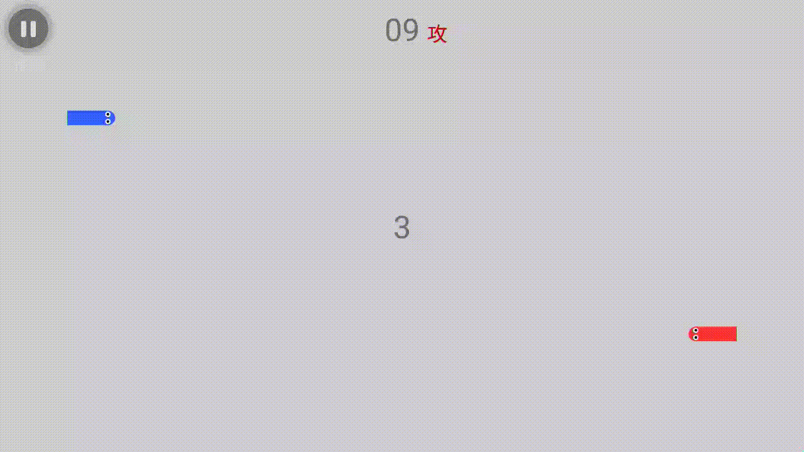

# TastySnake

A snake battle game on Android. 

The move direction of the snake is controlled by gravity sensor and the two devices communicate with each other through bluetooth.

## Demo

## Documentation

* [Module](./doc/module.md)

* [Database](./doc/database.md)

* [Data Analysis](./doc/data_analysis.md)

* [Custom Packet](./doc/packet.md)

## Release

* [TastySnake_1.0.0.161220.apk](./apk/TastySnake_1.0.0.161220.apk)

    * First release

* [TastySnake_1.0.1.161222.apk](./apk/TastySnake_1.0.1.161222.apk)

    * Fix connection bugs

    * Fix dialog bugs in Meizu

## License

See the [LICENSE](./LICENSE) file for license rights and limitations.
