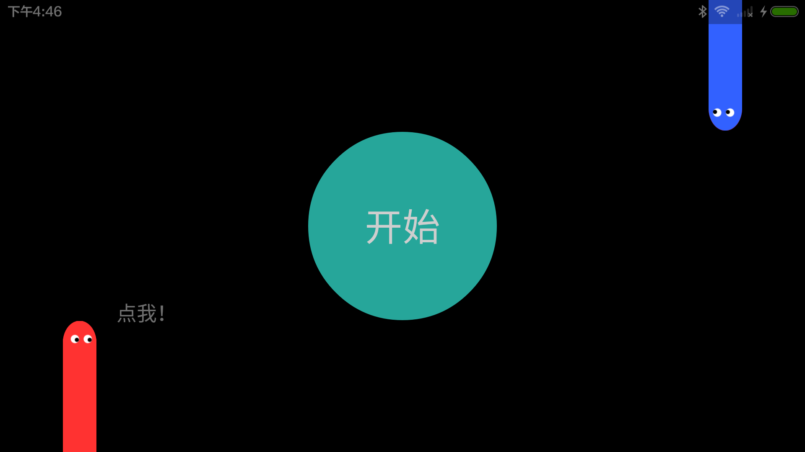
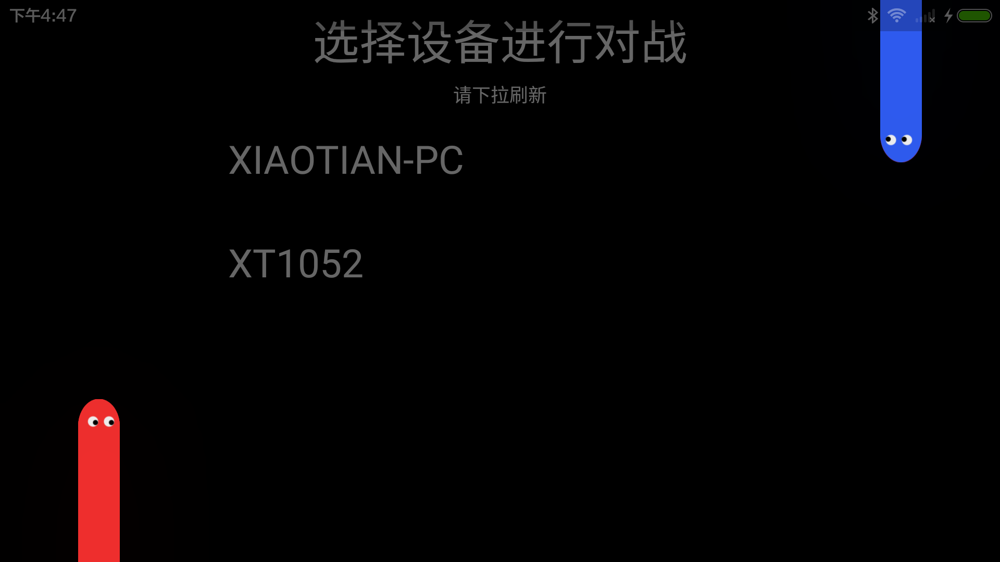
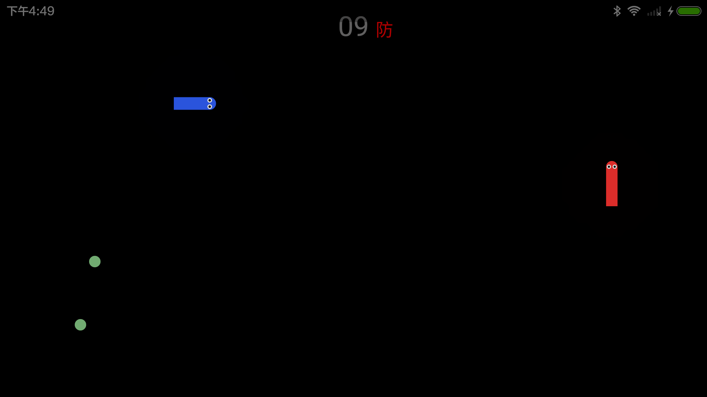
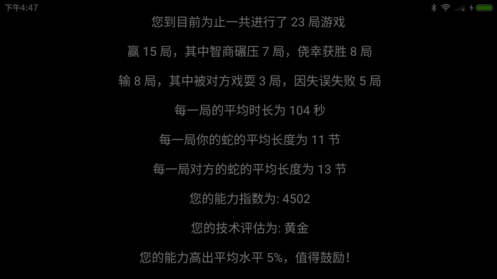
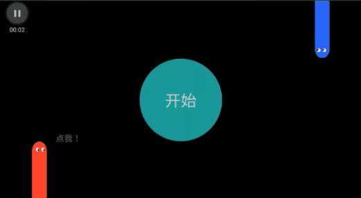
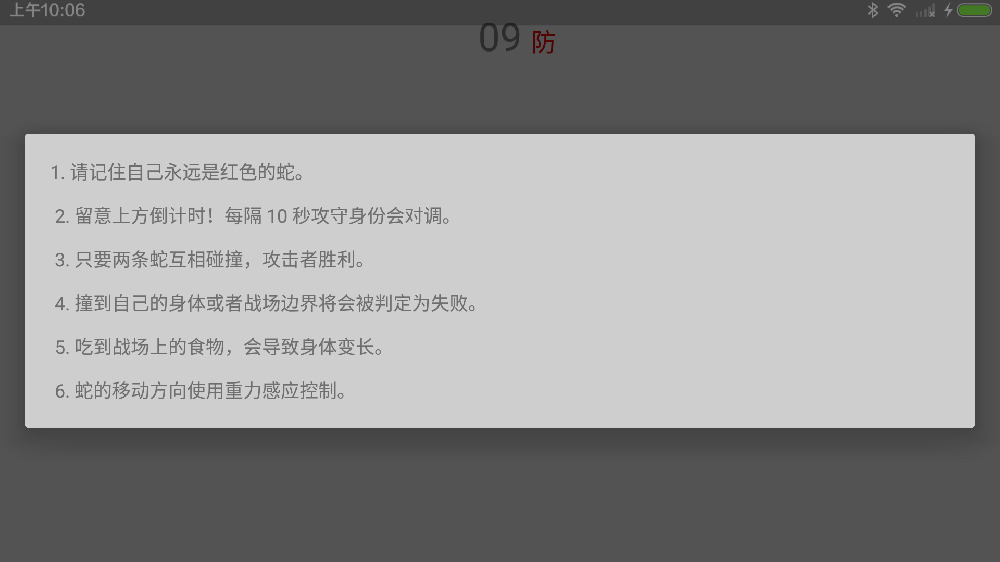

# 技术实现

#### 目录

* [Package Structure(包目录结构)](#package-structure)

* [Game UI(游戏界面)](#game-ui)

    * [SnakeImage(两侧蛇的动画)](#snakeimage)

    * [HelpDialog(游戏规则Dialog)](#helpdialog)

* [Game Elements(游戏元素)](#game-elements)

    * [Pos(坐标二元组)](#pos)

    * [Point(地图上的点)](#point)

    * [Map(地图)](#map)

    * [Snake(蛇)](#snake)

* [Plot(地图绘制)](#plot)

* [Bluetooth(蓝牙通信)](#bluetooth)

    * [Custom Packet(自定义数据包)](#custom-packet)

* [Sensor(传感器)](#sensor)

* [Network(网络通信)](#network)

* [Local Database(本地数据库)](#local-database)

    * [Operations(数据库操作)](#operations)

* [Data Analysis(数据分析)](#data-analysis)

    * [Local(本地数据分析)](#local)

    * [Remote(云端数据分析)](#remote)

    * [Upload(数据上传)](#upload)

* [Server(服务器)](#server)

## Package Structure

```
com.example.stevennl.tastysnake
    base        // 存放一些基类与通用接口
    controller  // 存放Activity
        game    // 存放游戏界面Activity
        test    // 存放测试界面Activity
    model       // 存放游戏元素类与游戏数据类
    util        // 存放通用工具类
    widget      // 存放自定义控件
```

## Game UI

游戏界面使用Activity + Fragment的方式编写，仅有一个Activity，即[GameActivity.java](../app/src/main/java/com/example/stevennl/tastysnake/controller/game/GameActivity.java)。四个游戏界面对应四个Fragment，组成如下：

| Source | Screenshot | Description |
|:------:|:----------:|-------------|
|[HomeFragment.java](../app/src/main/java/com/example/stevennl/tastysnake/controller/game/HomeFragment.java)||游戏主界面。点击红色的蛇进入数据分析界面，点击蓝色的蛇进行深色/浅色主题切换。|
|[ConnectFragment.java](../app/src/main/java/com/example/stevennl/tastysnake/controller/game/ConnectFragment.java)||设备连接界面。下拉刷新将重新扫描设备，点击列表中的设备即可与该设备进行连接。|
|[BattleFragment.java](../app/src/main/java/com/example/stevennl/tastysnake/controller/game/BattleFragment.java)||游戏对战界面。|
|[AnalysisFragment.java](../app/src/main/java/com/example/stevennl/tastysnake/controller/game/AnalysisFragment.java)||数据分析界面。|

### SnakeImage

注意到在游戏主界面和设备连接界面的两侧有一条红色和蓝色的蛇，在界面切换时将会产生如下动画：



我们将这两条蛇封装在了同一个自定义控件[SnakeImage.java](../app/src/main/java/com/example/stevennl/tastysnake/widget/SnakeImage.java)中。蛇会定时的眨眼睛，我们使用帧动画实现，红色蛇的帧动画文件如下：

```xml
<?xml version="1.0" encoding="utf-8"?>
<animation-list xmlns:android="http://schemas.android.com/apk/res/android"
    android:oneshot="false">
    <item android:drawable="@mipmap/snake_my" android:duration="1500" />
    <item android:drawable="@mipmap/snake_my_close" android:duration="150" />
    <item android:drawable="@mipmap/snake_my" android:duration="150" />
    <item android:drawable="@mipmap/snake_my_close" android:duration="150" />
    <item android:drawable="@mipmap/snake_my" android:duration="1000" />
    <item android:drawable="@mipmap/snake_my_close" android:duration="150" />
</animation-list>
```

蓝色蛇的帧动画文件内容类似。实现帧动画的思路很简单，我们准备一张睁眼和一张闭眼的蛇的图片，每隔一定时间交替显示这两张图片即可制造出眨眼睛的效果。上述xml文件就完成的图片交替的过程，`@mipmap/snake_my`引用睁眼的图片文件，`@mipmap/snake_my_close`引用闭眼的图片文件，`android:duration="150"`指明了当前图片显示的时间，最后只要将这个文件放进drawable目录下，将其设置成该控件的background即可。

除此之外，SnakeImage控件中提供了播放蛇进入和退出动画的方法，动画使用`ObjectAnimator`类实现：

```java
/**
 * Show snake enter animation.
 *
 * @param endListener An {@link AnimationEndListener}
 */
public void startEnter(@Nullable final AnimationEndListener endListener) {
    float dist = offsetMarginPixel;
    switch (direc) {  // 区分向上出现和向下出现的蛇
        case UP:
            anim = ObjectAnimator.ofFloat(this, ATTR_TRANSY, 0, -dist)
                    .setDuration(Config.DURATION_SNAKE_ANIM);
            break;
        case DOWN:
            anim = ObjectAnimator.ofFloat(this, ATTR_TRANSY, 0, dist)
                    .setDuration(Config.DURATION_SNAKE_ANIM);
            break;
        default:
            break;
    }
    anim.addListener(new Animator.AnimatorListener() {
        @Override
        public void onAnimationStart(Animator animation) {
            // Do nothing
        }

        @Override
        public void onAnimationEnd(Animator animation) {
            if (endListener != null) {
                endListener.onAnimationEnd(animation);
            }
            anim = null;
        }

        @Override
        public void onAnimationCancel(Animator animation) {
            // Do nothing
        }

        @Override
        public void onAnimationRepeat(Animator animation) {
            // Do nothing
        }
    });
    anim.start();
}

/**
 * Show snake exit animation.
 *
 * @param endListener An {@link AnimationEndListener}
 */
public void startExit(@Nullable final AnimationEndListener endListener) {
    float offset = getHeight() - offsetMarginPixel;
    switch (direc) {  // 区分向上出现和向下出现的蛇
        case UP:
            anim = ObjectAnimator.ofFloat(this, ATTR_TRANSY, getTranslationY(), offset)
                    .setDuration(Config.DURATION_SNAKE_ANIM);
            break;
        case DOWN:
            anim = ObjectAnimator.ofFloat(this, ATTR_TRANSY, getTranslationY(), -offset)
                    .setDuration(Config.DURATION_SNAKE_ANIM);
            break;
        default:
            break;
    }
    anim.addListener(new Animator.AnimatorListener() {
        @Override
        public void onAnimationStart(Animator animation) {
            // Do nothing
        }

        @Override
        public void onAnimationEnd(Animator animation) {
            if (endListener != null) {
                endListener.onAnimationEnd(animation);
            }
            anim = null;
        }

        @Override
        public void onAnimationCancel(Animator animation) {
            // Do nothing
        }

        @Override
        public void onAnimationRepeat(Animator animation) {
            // Do nothing
        }
    });
    anim.start();
}
```

这两个方法都传入了一个`AnimationEndListener`接口，它将在动画播放结束时被调用。在界面刚打开时，动画结束之后才会执行该界面的逻辑，在退出界面时，动画结束之后才会真正切换到下一个界面，这就是这个回调接口的作用。

### HelpDialog

设备连接成功、游戏开始之前会显示如下的Dialog显示游戏规则：



这个Dialog封装在了一个自定义控件[HelpDialog.java](../app/src/main/java/com/example/stevennl/tastysnake/widget/HelpDialog.java)中，只需要调用`HelpDialog.show()`即可显示此Dialog。另外，此Dialog的构造函数中需要传入一个`DialogInterface.OnCancelListener`接口，它将在Dialog被关闭之后调用。

## Game Elements

在进行游戏元素的搭建此之前，我们先定义一个[Direction.java](../app/src/main/java/com/example/stevennl/tastysnake/model/Direction.java)枚举类表示游戏中的方向，移动方向只有上下左右四个，另外添加一个方向NONE，表示无移动方向：

```java
public enum Direction {
    UP,
    RIGHT,
    DOWN,
    LEFT,
    NONE
}
```

游戏元素的搭建主要由Pos、Point、Map、Snake这四个类完成，下面分别进行讲述。

### Pos

[Pos.java](../app/src/main/java/com/example/stevennl/tastysnake/model/Pos.java)是一个二维平面的坐标二元组，里面只有两个属性：x和y，表示平面上的横坐标与纵坐标。在我们的地图上，横坐标对应行号，纵坐标对应列号。这个类提供两个主要方法：

```java
/**
 * Return the position at a given direction(relative to self).
 */
public Pos getPosAt(Direction k) {
    return new Pos(x + dx[k.ordinal()], y + dy[k.ordinal()]);
}

/**
 * Return the direction of current position relative to a given position.
 *
 * @param p The given position
 */
public Direction getDirectionRelativeTo(Pos p) {
    for (int i = 0; i < 4; i ++) {
        Direction d = Direction.values()[i];
        if (p.getPosAt(d).equals(this))
            return d;
    }
    return Direction.NONE;
}
```

`getPosAt(Direction k)`用于获取邻接位置的坐标，`getDirectionRelativeTo(Pos p)`用于获取当前位置相对于邻接位置的方向。

### Point

[Point.java](../app/src/main/java/com/example/stevennl/tastysnake/model/Point.java)是地图上任意一个点，在每个点我们储存该点的类型和颜色值：

```java
/**
 * Point on the game map.
 */
public class Point {
    private int color;
    private Type type;

    // 点的类型共13种
    public enum Type {
        BLANK,
        FOOD_LENGTHEN,
        FOOD_SHORTEN,
        HEAD_L,
        HEAD_U,
        HEAD_R,
        HEAD_D,
        BODY_HOR,
        BODY_VER,
        BODY_L_U,
        BODY_L_D,
        BODY_R_U,
        BODY_R_D
    }
}
```

注意到Type中4个HEAD开头的值表示了朝向四个方向的蛇头，BODY_HOR和BODY_VER分别表示水平和垂直的身体，最后的4个BODY开头的值表示拐弯部分的蛇身。另外，FOOD_SHORTEN表示吃了能让蛇变短的食物，基于游戏策略的考虑，我们暂时没把这类食物加入游戏中。

### Map

[Map.java](../app/src/main/java/com/example/stevennl/tastysnake/model/Map.java)是游戏地图，显然，这里面存放了一个Point二维数组：

```java
/**
 * Game map.
 */
public class Map {
    private Point[][] content;
    private int row;
    private int col;
}
```

除此之外，该类提供了创建食物和读写地图内容的方法：

```java
/**
 * Create food at a given position.
 *
 * @param x The row number of the food
 * @param y The column number of the food
 * @param lengthen True if the food will lengthen the snake who eats it, false shorten
 */
public void createFood(int x, int y, boolean lengthen) {
    content[x][y].setColor(lengthen ? Config.COLOR_FOOD_LENGTHEN : Config.COLOR_FOOD_SHORTEN);
    content[x][y].setType(lengthen ? Point.Type.FOOD_LENGTHEN : Point.Type.FOOD_SHORTEN);
}

/**
 * Set a point on the map.
 *
 * @param p The position of the new point
 * @param c The new point
 */
public void setPoint(Pos p, Point c) {
    if (isValid(p.getX(), p.getY())) {
        content[p.getX()][p.getY()] = c;
    }
}

/**
 * Return a point on the map.
 *
 * @param x The row number of the point
 * @param y The column number of the point
 */
public Point getPoint(int x, int y) {
    if (!isValid(x, y))  {
        return new Point();
    }
    return content[x][y];
}
```

这几个方法都是一目了然的，这里不做过多的介绍。

### Snake

[Snake.java](../app/src/main/java/com/example/stevennl/tastysnake/model/Snake.java)是游戏中移动的蛇，该类有如下几个属性：

```java
/**
 * Game snake.
 */
public class Snake {
    // 蛇身的坐标集合
    private ArrayList<Pos> bodies = new ArrayList<>();

    // 蛇身的Point类型集合
    private ArrayList<Point.Type> types = new ArrayList<>();

    // 蛇的当前移动方向
    private Direction direc;

    // 蛇移动的地图
    private Map map;

    // 蛇身的颜色
    private int color;

    // 蛇的类型
    private Type type;

    /**
     * Type of the snake.
     * 用于区分蓝牙服务端的蛇和蓝牙客户端的蛇。
     */
    public enum Type {
        SERVER,
        CLIENT
    }

    /**
     * Result after snake moves.
     */
    public enum MoveResult {
        OUT,        // 移出战场边界
        SUICIDE,    // 撞到自己
        HIT_ENEMY,  // 撞到另一条蛇
        SUC,        // 成功移动
    }
}
```

这个类的三个主要方法如下：

```java
/**
 * 将蛇向order方向移动一步。
 */
public MoveResult move(Direction order);

/**
 * 计算蛇的移动结果。
 */
private MoveResult calMoveResult();

/**
 * 生成当前蛇身的Point类型集合。
 */
private void genType();
```

具体实现请参考源码。

## Plot

整张地图的绘制方法封装在了[DrawableGrid.java](../app/src/main/java/com/example/stevennl/tastysnake/widget/DrawableGrid.java)这个自定义控件中，在游戏界面的布局中我们只需要简单的添加这个控件即可在屏幕上显示一张地图：

```xml
<?xml version="1.0" encoding="utf-8"?>
<RelativeLayout xmlns:android="http://schemas.android.com/apk/res/android"
    xmlns:tools="http://schemas.android.com/tools"
    xmlns:DrawableGrid="http://schemas.android.com/apk/res-auto"
    android:id="@+id/activity_drawable_grid_test"
    android:layout_width="match_parent"
    android:layout_height="match_parent"
    tools:context="com.example.stevennl.tastysnake.controller.test.DrawableGridTestActivity">
    <com.example.stevennl.tastysnake.widget.DrawableGrid
        android:id="@+id/drawablegrid_test_grid"
        android:layout_width="match_parent"
        android:layout_height="match_parent"
        DrawableGrid:showGridLine="false"/>
</RelativeLayout>
```

在Activity中对这个控件进行初始化：

```java
DrawableGrid grid = (DrawableGrid) findViewById(R.id.drawablegrid_test_grid);
grid.setMap(map);
grid.setBgColor(Config.COLOR_MAP_BG);
```

这里的`setMap(Map map)`方法将一张地图绑定到此控件，该控件每隔一定时间遍历地图中的Point数组，将每个点的信息绘制到屏幕上。关于Map和Point等元素的定义请参考[Game Elements](#game-elements)。

了解了绘图过程之后，我们接下来看一下这个自定义控件的内部实现，它继承自SurfaceView，SurfaceView的特点是可以在子线程中绘图，这样在频繁绘图时不会阻塞主线程。我们首先需要给SurfaceView添加回调接口，以便在恰当的生命周期开始绘图与停止绘图：

```java
/**
 * This view can divide the screen to several grids and draw the content of each grid.
 */
public class DrawableGrid extends SurfaceView implements SurfaceHolder.Callback {

    /**
     * Initialize from XML resources file.
     *
     * @param context The context
     * @param attrs The attributes set
     */
    public DrawableGrid(Context context, @Nullable AttributeSet attrs) {
        super(context, attrs);
        Log.d(TAG, "DrawableGrid()");
        if (attrs != null) {
            initCustomAttr(context, attrs);
        }
        setKeepScreenOn(true);
        getHolder().addCallback(this);  // 添加回调接口
    }

    // Surface创建时开启绘图线程进行绘图
    @Override
    public void surfaceCreated(SurfaceHolder holder) {
        Log.d(TAG, "surfaceCreated()");
        drawThread = new DrawThread(holder);
        drawThread.setRunning(true);
        drawThread.start();
    }

    // Surface尺寸等参数变化时更新绘图所依赖的参数
    @Override
    public void surfaceChanged(SurfaceHolder holder, int format, int width, int height) {
        Log.d(TAG, "surfaceChanged()");
        drawThread.updateParams();
    }

    // Surface被销毁时停止绘图线程
    @Override
    public void surfaceDestroyed(SurfaceHolder holder) {
        Log.d(TAG, "surfaceDestroyed()");
        drawThread.setRunning(false);
    }
}
```

绘图线程DrawThread的`updateParams()`方法计算了进行绘图所需要的参数，包括每个格子的水平、垂直方向上的宽度、偏移量等：

```java
private void updateParams() {
    int width = getWidth();
    int height = getHeight();
    if (showGridLine) {
        int horLineCnt = rowCount + 1;
        int verLineCnt = colCount + 1;
        width -= verLineCnt;
        height -= horLineCnt;
    }
    horInterval = width / colCount;
    verInterval = height / rowCount;
    horOffset = (width % colCount) / 2;
    verOffset = (height % rowCount) / 2;
}
```

该线程的`run()`方法每隔一段时间调用`draw()`方法进行地图绘制：

```java
@Override
public void run() {
    while (running) {
        try {
            if (!pause) {
                draw();
                Thread.sleep(Config.FREQUENCY_DRAW);
            }
        } catch (Exception e) {
            Log.e(TAG, "", e);
        }
    }
}

private void draw() {
    try {
        // 从SurfaceHolder中获取画布并锁定该画布
        canvas = holder_.lockCanvas();
        if (canvas != null) {
            canvas.drawColor(bgColor);
            drawMapContent(canvas);  // 在锁定的画布上绘制地图内容
        }
    } catch (Exception e) {
        Log.e(TAG, "", e);
    } finally {
        if (canvas != null) {
            holder_.unlockCanvasAndPost(canvas);  // 解锁画布，提交更改
        }
    }
}

private void drawMapContent(Canvas canvas) {
    if (map == null) return;
    float left, top, right, bottom;
    // 遍历地图上每个点，分别绘制每个点的内容
    for (int i = 0; i < rowCount; ++i) {
        for (int j = 0; j < colCount; ++j) {
            Point point = map.getPoint(i, j);
            if (showGridLine || point.getType() != Point.Type.BLANK) {
                paint.setColor(point.getColor());
                // 计算当前Point绘制的起始位置、终止位置等参数
                left = (showGridLine ? horOffset + 1 + j * (horInterval + 1)
                        : horOffset + j * horInterval);
                top = (showGridLine ? verOffset + 1 + i * (verInterval + 1)
                        : verOffset + i * verInterval);
                right = left + horInterval;
                bottom = top + verInterval;
                // 绘制当前Point的内容
                drawGrid(left, top, right, bottom, point.getType(), canvas);
            }
        }
    }
}
```

`drawGrid()`方法根据Point的内容将图形绘制到指定位置，目前这个游戏的地图上的元素只有圆形、矩形，直接调用`canvas.drawRect()`和`canvas.drawCircle()`即可完成绘制，网上有许多资料说明如何用canvas绘制几何图形，这里就不再展开叙述了。

## Bluetooth

蓝牙通信根据官方的[蓝牙通信文档](https://developer.android.com/guide/topics/connectivity/bluetooth.html)编写，基于Andorid的BluetoothAdapter实现。我们将与蓝牙通信相关的API封装在了[BluetoothManager.java](../app/src/main/java/com/example/stevennl/tastysnake/util/bluetooth/BluetoothManager.java)这个工具类中，蓝牙的打开与设备发现过程官方文档已经有详细说明，这里不再展开叙述。蓝牙通信比较关键的地方在于三条线程的协调，首先是服务端的接收线程[AcceptThread.java](../app/src/main/java/com/example/stevennl/tastysnake/util/bluetooth/thread/AcceptThread.java)，这条线程的`run()`方法如下：

```java
/**
 * Keep listening until exception occurs or a socket is returned
 */
@Override
public void run() {
    if (serverSocket == null) {
        return;
    }
    BluetoothSocket socket = null;
    Log.d(TAG, "Bluetooth server is listening...");
    while (true) {
        try {
            // accept()方法是阻塞的，当有客户端连接成功或者产生异常时此方法终止
            socket = serverSocket.accept();
        } catch (IOException e) {
            Log.e(TAG, "Error:", e);
            errorListener.onError(OnErrorListener.ERR_SERVER_SOCKET_ACCEPT, e);
            break;
        }
        try {
            if (socket != null) {
                onSocketEstablishedListener.onSocketEstablished(socket, stateListener, errorListener);
                serverSocket.close();
                break;
            }
        } catch (IOException e) {
            Log.e(TAG, "Error:", e);
            errorListener.onError(OnErrorListener.ERR_SOCKET_CLOSE, e);
            break;
        }
    }
    Log.d(TAG, "Thread ended.");
}
```

另一条是客户端的连接线程[ConnectThread.java](../app/src/main/java/com/example/stevennl/tastysnake/util/bluetooth/thread/ConnectThread.java)，这条线程的`run()`方法如下：

```java
/**
 * Connect the device and get the socket.
 */
@Override
public void run() {
    if (socket == null) {
        return;
    }
    try {
        Log.d(TAG, "Connecting remote device...");
        // 连接服务器socket，这个方法也是阻塞的，直到连接成功或者抛出异常才停止
        socket.connect();
    } catch (IOException connectException) {
        Log.e(TAG, "Error:", connectException);
        errorListener.onError(OnErrorListener.ERR_CLIENT_SOCKET_CONNECT, connectException);
        try {
            socket.close();
        } catch (IOException closeException) {
            Log.e(TAG, "Error:", closeException);
            errorListener.onError(OnErrorListener.ERR_SOCKET_CLOSE, closeException);
        }
        return;
    }
    onSocketEstablishedListener.onSocketEstablished(socket, stateListener, errorListener);
    Log.d(TAG, "Thread ended.");
}
```

客户端、服务端连接成功后，上述两条线程都会调用`onSocketEstablishedListener.onSocketEstablished()`方法，该接口的声明如下：

```java
/**
 * Listener for socket establishment of device connection.
 */
public interface OnSocketEstablishedListener {

    /**
     * Called when a connection socket is established.
     *
     * @param socket The connection socket
     * @param stateListener A {@link OnStateChangedListener}
     * @param errorListener A {@link OnErrorListener}
     */
    void onSocketEstablished(BluetoothSocket socket,
                             OnStateChangedListener stateListener,
                             OnErrorListener errorListener);
}
```

这个接口将在BluetoothManager的如下两个方法中传给两个线程：

```java
/**
 * Run a bluetooth server thread to listen to the connection request.
 */
public void runServerAsync(OnStateChangedListener stateListener_,
                           OnErrorListener errorListener_) {
    if (!isServerRunning()) {
        acceptThread = new AcceptThread(bluetoothAdapter, new OnSocketEstablishedListener() {
            @Override
            public void onSocketEstablished(BluetoothSocket socket,
                                            OnStateChangedListener stateListener,
                                            OnErrorListener errorListener) {
                stateListener.onServerSocketEstablished();
                manageConnectedSocket(socket, stateListener, errorListener);
            }
        }, stateListener_, errorListener_);
        acceptThread.start();
        Log.d(TAG, "Server running...");
    }
}

/**
 * Connect a bluetooth server.
 *
 * @param device The device to connect
 */
public void connectDeviceAsync(BluetoothDevice device,
                               OnStateChangedListener stateListener_,
                               OnErrorListener errorListener_) {
    cancelDiscovery();  // Discovery process will slow down the connection
    if (!isClientConnecting()) {
        connectThread = new ConnectThread(device, new OnSocketEstablishedListener() {
            @Override
            public void onSocketEstablished(BluetoothSocket socket,
                                            OnStateChangedListener stateListener,
                                            OnErrorListener errorListener) {
                stateListener.onClientSocketEstablished();
                manageConnectedSocket(socket, stateListener, errorListener);
            }
        }, stateListener_, errorListener_);
        connectThread.start();
        Log.d(TAG, "Connecting...");
    }
}
```

两个方法的方法名是自解释的，一个用于启动服务器线程，另一个用于启动客户端线程，传入的`OnSocketEstablishedListener`接口中调用了`manageConnectedSocket()`方法。这个方法利用连接成功后的socket建立数据通道，即打开数据通信线程[ConnectedThread.java](../app/src/main/java/com/example/stevennl/tastysnake/util/bluetooth/thread/ConnectedThread.java)，这个线程的`run()`方法中不断从输入流读取数据，即不断读取远程设备发过来的数据：

```java
/**
 * Keep listening to the InputStream until an exception occurs.
 */
@Override
public void run() {
    if (inStream == null || outStream == null) {
        return;
    }
    byte[] buffer = new byte[Packet.SIZE];
    stateListener.onDataChannelEstablished();
    Log.d(TAG, "Open input stream...");
    while (true) {
        try {
            // 如果输入流没有数据，read()方法是阻塞的，直到输入流有数据，此方法才会返回
            int bytesCnt = inStream.read(buffer);
            if (dataListener != null) {
                dataListener.onReceive(bytesCnt, buffer);
            }
        } catch (IOException e) {
            Log.e(TAG, "Error:", e);
            errorListener.onError(OnErrorListener.ERR_STREAM_READ, e);
            break;
        }
    }
    Log.d(TAG, "Thread ended.");
}
```

另外，此线程暴露一个public方法供外部向输出流写入数据，即不断向远程设备发送数据：

```java
/**
 * Write data to remote device.
 *
 * @param data The data to be sent
 */
public void write(byte[] data) {
    try {
        Log.d(TAG, "Data of size " + data.length + " will be sent.");
        outStream.write(data);
    } catch (IOException e) {
        Log.e(TAG, "Error:", e);
        errorListener.onError(OnErrorListener.ERR_STREAM_WRITE, e);
    }
}
```

### Custom Packet

从上面的数据传输方式可以看到，数据以`byte[]`也就是字节流形式在两台设备之间进行传输。为了使传输数据更为方便，数据更加结构化，我们封装了一个自定义数据包[Packet.java](../app/src/main/java/com/example/stevennl/tastysnake/model/Packet.java)，此数据包可以转换为`byte[]`，也可以利用`byte[]`进行构造，并且其大小是**固定的**(5 bytes)。

为了完成`Packet`和`byte[]`的相互转换，我们用`String`作为桥梁，即每个`Packet`可以等价的表示为一个`String`，而`String`对象是可以利用java的API和`byte[]`类型相互转换的。

我们将每个数据包表示为字符串TABCD，每个字母代表一个字符，字符T标识数据包的类型，字符A、B、C、D存放数据包的数据。若数据长度不够，采用空格填充。

以下是游戏中所用到的自定义数据包：

| Type | Data | Description |
|:----:|------|-------------|
|FOOD_LENGTHEN|AB: 食物的横坐标。<br />CD: 食物的纵坐标。|包含一个变长食物的位置。|
|FOOD_SHORTEN|AB: 食物的横坐标。<br />CD: 食物的纵坐标。|包含一个变短食物的位置。|
|MOVE|A: 移动方向。|包含一个蛇的移动方向。|
|RESTART|A: 新一轮游戏的攻击方。|包含重新开始游戏的信号，里面附带了新一轮游戏的攻击方。|
|TIME|AB: 攻防切换的剩余时间。|包含了对战中攻防切换的剩余时间。|
|WIN|A: 胜利方。<br />B: 游戏结束的原因。|包含了游戏结束的信号，里面附带了胜利方以及获胜的原因。|
|PREPARED|不需要存任何数据。|包含了准备完成的信号，只有双方均准备完成游戏才可以开始。|

## Sensor

游戏中的蛇的移动方向是使用重力感应控制的，我们将与传感器相关的API封装在了[SensorController.java](../app/src/main/java/com/example/stevennl/tastysnake/util/sensor/SensorController.java)这个工具类中，它使用安卓设备提供的加速度传感器，获取x/y两个方向的加速度。为了获取初始数据确定x/y的使用，在测试中发现如下极端数据：（横屏）

```java
/**
 *      Left    Right   Up      Down
 * X    6       -6      0       0
 * Y    0       0       -5      7
 * Z    7       7       8       6
 */
```

观察可知，平面上的上下左右运动跟z加速度无关，去除；在判定上下运动时，跟y无关；在判定左右运动时，跟x无关。一个直接的实现想法是，首先判定x、y的绝对值大小：比如当x的绝对值比y小时，说明当前应当优先判断上下运动。然后判断x的正负情况，如果x为正，则是下运动。

为了优化重力感应体验，使用一个加速度accXAcc、accYAcc，来衡量加速度xAccValue、yAccValue的变化速度，也就是衡量玩家游戏时摆动手机的速度。具体如下：

1. 生成两个方法，供上层使用：在蛇做上下运动时，只判断左右方向；做左右运动时，只判断上下方向。

2. ACC_BOUND可以调整加速度accXAcc的阈值，控制灵敏度。

3. MIN_SEN可以控制判定的灵敏度，减少误操作。

4. HIGH_SEN控制极端情况，保证在某一方向的极端操作得到响应。

5. 此操作的优势之一是响应玩家摆动动作，而不是手机的加速度状态。另外，在向某一个角大幅度摆动时，可以得到“之”字型的走位。

6. 优化的几个参数还在调整，可以在[sensor_optimize分支](https://github.com/stevennL/TastySnake/tree/sensor_optimize)下查看，目前还未与主分支合并。

## Network

应用中的网络请求模块使用了Google提供的轻量级网络访问框架[volley](https://android.googlesource.com/platform/frameworks/volley/+/4ad53e3321d9bed5a216d65623d92c91c5457e55)，此框架提供了一个请求队列(RequestQueue)，可以将网络请求添加至此队列，交给volley去发送。与网络请求相关的API封装在[NetworkUtil.java](../app/src/main/java/com/example/stevennl/tastysnake/util/network/NetworkUtil.java)这个工具类中。

有了这个框架，我们要做的就是将应用中的请求URL和请求参数封装起来。为此，我们先进行通用的GET请求和POST请求的封装：

```java
/**
 * Send a GET request.
 *
 * @param url The server url
 * @param params GET parameters
 * @param resListener Called when receiving response
 * @param errListener Called when error occurs
 */
public void get(String url, Map<String, String> params,
                Response.Listener<String> resListener, Response.ErrorListener errListener) {
    String getUrl = buildUrl(url, params);
    Log.d(TAG, "Get url: " + getUrl);
    StringRequest req = new StringRequest(getUrl, resListener, errListener);
    req.setRetryPolicy(new DefaultRetryPolicy(Config.REQ_TIMEOUT,
            DefaultRetryPolicy.DEFAULT_MAX_RETRIES, DefaultRetryPolicy.DEFAULT_BACKOFF_MULT));
    req.setTag(REQUEST_TAG);
    queue.add(req);
}

/**
 * Send a POST request.
 *
 * @param url The server url
 * @param params POST parameters
 * @param resListener Called when receiving response
 * @param errListener Called when error occurs
 */
public void post(String url, final Map<String, String> params,
                 Response.Listener<String> resListener, Response.ErrorListener errListener) {
    StringRequest req = new StringRequest(Request.Method.POST, url, resListener, errListener) {
        @Override
        protected Map<String, String> getParams() throws AuthFailureError {
            return params;
        }
    };
    req.setRetryPolicy(new DefaultRetryPolicy(Config.REQ_TIMEOUT,
            DefaultRetryPolicy.DEFAULT_MAX_RETRIES, DefaultRetryPolicy.DEFAULT_BACKOFF_MULT));
    req.setTag(REQUEST_TAG);
    queue.add(req);
}
```

有了通用的发送GET和POST请求的方法后，就可以开始封装应用所需要发送的每一个具体请求了。在此之前，我们先定义一个回调接口`ResultListener<T>`，方法`void onGotResult(T result)`将在客户端收到服务端返回的信息并解析出结构化的数据之后调用，这个结构化的数据将存放在result参数中，方法`void onError(VolleyError err)`将在出现异常之后调用：

```java
/**
 * Listener for network result.
 *
 * @param <T> The type of result
 */
public interface ResultListener<T> {
    /**
     * Called when the result is got
     *
     * @param result The result got
     */
    void onGotResult(T result);

    /**
     * Called when error occurs.
     *
     * @param err {@link VolleyError}
     */
    void onError(VolleyError err);
}
```

接下来进行具体请求的封装，第一个需要用到的请求是向服务器发送最新统计出的能力指数值W，关于数据统计的细节可以直接看[数据分析部分](#data-analysis)。我们使用POST请求完成这项功能，参数除了附带W值，还要附带上设备的ID号：

```java
/**
 * Insert a W value to remote database.
 *
 * @param w The W value to be inserted
 * @param listener A {@link ResultListener}
 */
public void insertW(int w, @Nullable final ResultListener<String> listener) {
    Map<String, String> params = new HashMap<>();
    params.put("id", Config.DEVICE_ID);
    params.put("w", String.valueOf(w));
    post(Config.URL_INSERT_W, params, new Response.Listener<String>() {
        @Override
        public void onResponse(String response) {
            Log.d(TAG, "insertW() response: " + response);
            if (listener != null) {
                listener.onGotResult(response);
            }
        }
    }, new Response.ErrorListener() {
        @Override
        public void onErrorResponse(VolleyError error) {
            Log.e(TAG, "insertW(): " + error.toString());
            if (listener != null) {
                listener.onError(error);
            }
        }
    });
}
```

第二个要用到的请求是获得服务器数据库中的W的平均值，使用GET请求实现，无需附带参数：

```java
/**
 * Get average W value from remote server.
 *
 * @param listener A {@link ResultListener}
 */
public void getAvgW(@Nullable final ResultListener<Integer> listener) {
    get(Config.URL_GET_AVG_W, null, new Response.Listener<String>() {
        @Override
        public void onResponse(String response) {
            Log.d(TAG, "getAvgW() response: " + response);
            int avgW = 0;
            try {
                // 服务器返回的是字符串，使用如下方法解析成整数值
                avgW = Integer.parseInt(response);
            } catch (NumberFormatException e) {
                Log.e(TAG, "getAvgW() error:", e);
            }
            if (listener != null) {
                listener.onGotResult(avgW);
            }
        }
    }, new Response.ErrorListener() {
        @Override
        public void onErrorResponse(VolleyError error) {
            Log.e(TAG, "getAvgW(): " + error.toString());
            if (listener != null) {
                listener.onError(error);
            }
        }
    });
}
```

其余的请求方法如`getAllW()`、`removeW()`、`removeAllW()`等供调试使用，这里就不一一叙述了。

## Local Database

数据库名: TastySnake.db

数据库版本: 1

数据库表：

**1.battle_record**

| Name | Type In Code | Type In DB | Comment |
|------|--------------|------------|---------|
|timestamp|java.util.Date|TEXT|对战结束时的时间戳 (年/月/日 + 时/分/秒)
|win|boolean|INTEGER|对战结果：赢/输|
|cause|Snake.MoveResult|INTEGER|对战结束的原因：OUT、SUICIDE或HIT_ENEMY|
|duration|int|INTEGER|对战的持续时间(秒)|
|myLength|int|INTEGER|对战结束时自身蛇长|
|enemyLength|int|INTEGER|对战结束时对方蛇长|

### Operations

对本地数据库的操作封装在[DBHelper.java](../app/src/main/java/com/example/stevennl/tastysnake/util/DBHelper.java)中。

battle_record表的记录封装在[BattleRecord.java](../app/src/main/java/com/example/stevennl/tastysnake/model/BattleRecord.java)中。

## Data Analysis

我们对本地数据库和服务器数据库中的数据进行分析。

### Local

对本地数据库中的数据进行分析。

#### 描述

1. 您到目前为止一共进行了N局游戏。

2. 赢X局，其中智商碾压A局，侥幸获胜B局。

3. 输Y局，其中被对方戏耍C局，因失误失败D局。

4. 每一局的平均时长为T秒。

5. 每一局你的蛇的平均长度为L1节。

6. 每一局对方的蛇的平均长度为L2节。

7. 您的能力指数为W。

8. 您的技术评估为P。

#### 定义

智商碾压：win=true && cause=HIT_ENEMY

侥幸获胜：win=true && (cause=OUT || cause=SUICIDE)

被对方戏耍：win=false && cause=HIT_ENEMY

因失误失败：win=false && (cause=OUT || cause=SUICIDE)

W = (100/N)\*((7\*A+5\*B)\*(18-log2(T+1))+(1\*C+3\*D)\*log2(T+2))

| P | Range |
|:-:|:-----:|
|王者|W >= 8500|
|大师|6100 <= W < 8500|
|黄金|3800 <= W < 6100|
|白银|1500 <= W < 3800|
|青铜|W < 1500|

使用这个[MATLAB程序](./program/formula_test.m)可以测试W和P的函数曲线。

### Remote

对服务器数据库中的数据进行分析。

#### 描述

1. 您的能力高出平均水平U%，值得鼓励！

2. 您的能力等于平均水平，加油！

3. 您的能力低于平均水平U%，再加把劲！

#### 定义

```java
avg = getAvgWValueFromServer();
if (W > avg) {
    showDescription1();
    U = 100 * (W - avg) / avg;
} else if (W == avg) {
    showDescription2();
} else if (W < avg) {
    showDescription3();
    U = 100 * (avg - W) / avg;
}
```

### Upload

使用[UploadService.java](../app/src/main/java/com/example/stevennl/tastysnake/util/network/UploadService.java)上传数据。

## Server

### 后端设计
服务器使用`play2`框架，其优点在于访问并发控制和jdbc并发控制都已经通过进程池封装完成，而且有很成熟的MVC框架，http引擎是java内置的netty。服务器端的架构是MVC，model是一个支持CRUD的封装后的数据库，通过依赖注入的方式注入controller，controller负责处理具体的网络请求。
由于客户端只会请求所有战斗力的平均值，所以在内存中保存一个聚合操作的中间结果---sum，并保证这个结果和数据库是一致的，这就要求`model.Data`是一个`Eager Singleton`，在处理查询和插入时，维护sum。
调试功能包括：删除指定id，清空数据库
### 插入操作
插入操作需要区分该id是第一次插入还是需要更新一个已有的id，这两种方法对于sum的更新是不同的。
### 查询操作
查询操作需要获取平均值，sum是已经维护好的，那么如何快速获取数据库的行数呢，使用mysql的SCHEMA数据库`INFORMATION_SCHEMA.INNODB_TABLE_STATS`，在其中按照表名查询就可以获得表的`rows`属性，这样我们查询操作的总体复杂度是常数时间。
处理POST参数使用模式匹配的方法。

### 路由表
```
# Home page
GET     /                           controllers.Application.index

# Map static resources from the /public folder to the /assets URL path
GET     /assets/*file               controllers.Assets.at(path="/public", file)

# List All
GET    /w/all                       controllers.Application.listAll

# Query Mean
GET     /w/mean                     controllers.Application.queryMean

# Update W
POST   /w                           controllers.Application.update

# TRUNCATE W
GET    /w/clear                     controllers.Application.truncate

# Delete id
GET    /w/remove                    controllers.Application.delete(id: String ?= "")
```


### Controller
```java
class Application @Inject() (data: model.Data) extends Controller {
  def index = Action {Ok("Hello World")}
  def queryMean = Action {Ok(data.getSum / data.getRow)}
  def listAll = Action {Ok(data.getAllUsers)}
  def truncate = Action {data.truncate;Ok("database cleared");}
  def delete(id: String) = Action { implicit request =>
    data.delete(id)
    Ok(id + " deleted")
  }
  case class UserData(id: String, value: Int)
  val userForm = Form(
    mapping(
      "id" -> text,
      "w" -> number
    )(UserData.apply)(UserData.unapply)
  )
  def update = Action { implicit request =>
    userForm.bindFromRequest.fold(
      err => BadRequest,
      userData => {
        val (flag, rec) = data.exist(userData.id)
        if (flag) {
          data.update(userData.id, userData.value, rec)
        } else {
          data.insert(userData.id, userData.value)
        }
        Ok("OK")
      }
    )
  }
}
```
### Model
```java
class Data @Inject()(db: Database) {
  @volatile private var sum = 0
  def getSum: Int
  def getRow: Int
  /**
  * 检查id是否存在
  */
  def exist(id: String): (Boolean, Int)
  /**
  * 插入新值
  */
  def insert(id: String, value: Int): Unit
  /**
  * 更新用户战斗力
  */
  def update(id: String, value: Int, old: Int): Unit
  /**
  * 列出所有用户
  */
  def getAllUsers: String
  /**
  * 清空数据库
  */
  def truncate: Unit
  /**
  * 删除指定id
  */
  def delete(id: String): Unit
}
```
